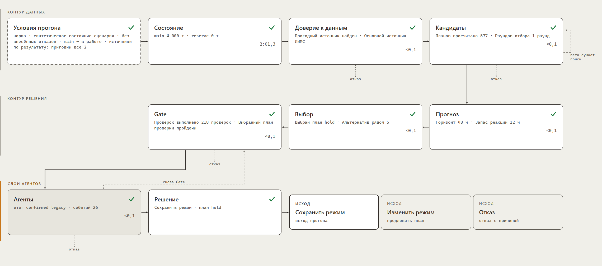
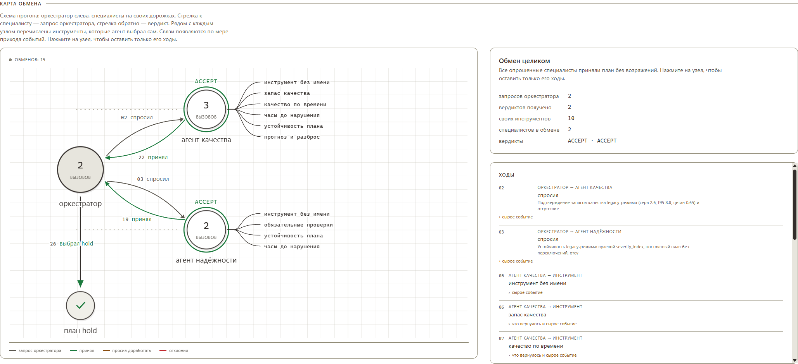
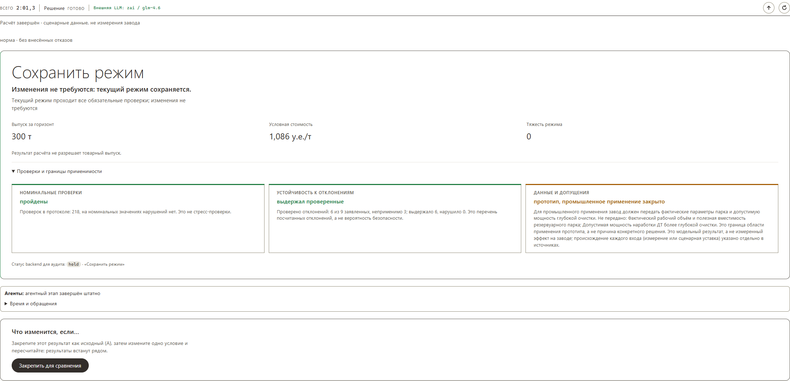
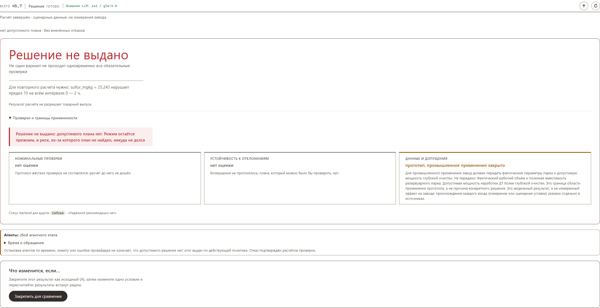

<p align="center">
  <picture>
    <source media="(prefers-color-scheme: dark)" srcset="src/frontend/public/brand/cutpoint-logo-light.svg"/>
    
  </picture>
</p>

<p align="center">
  <b>Советчик оператору цепочки АВТ → гидроочистка → смешение дизельного топлива.</b><br/>
  Мультиагентная система проверяет данные, прогнозирует серу, сравнивает планы<br/>
  и выдаёт рекомендацию, сохранение режима или объяснённый отказ.
</p>

<p align="center">
  <a href="https://neftecode.goatwhistle.ru/">
    
  </a>
</p>

<p align="center">
  <a href="#главное-за-30-секунд"></a>
  <a href="#за-три-минуты"></a>
  <a href="#куда-смотреть"></a>
  <a href="#что-мы-измерили"></a>
  <a href="#чего-мы-не-доказали"></a>
</p>

---

## Главное за 30 секунд

> **Заводы ошибаются не на тех числах, которые у них есть, — а на тех, которые они
> домысливают.** CUTPOINT отказывается угадывать: неизвестное остаётся неизвестным,
> отсутствие допустимого плана — это валидный ответ, а языковая модель может только
> ужесточить ограничение, никогда не ослабить.

Система работает на реальных данных завода: **189 217** десятиминутных строк телеметрии
за 2023–2026 годы, лабораторные анализы ЛИМС и поточный анализатор ПАК. Название — из
термина перегонки: *cut point*, температура отсечки, граница между фракциями. Система
проводит такую же границу между допустимым и недопустимым.

### Три решения, которых обычно не делают

<table>
<tr>
<td width="33%" valign="top">

**① Каждое число знает<br/>своё происхождение**

У любой величины есть метка:
`given` · `derived` · `scenario` · `open`.

Расчёт, которому нужен `open`,
возвращает «неизвестно» — не
подставляет правдоподобную
константу. Сценарное значение
нельзя прочитать как измерение.

</td>
<td width="33%" valign="top">

**② Отказ — это ответ,<br/>а не сбой**

Если данные непригодны или
допустимого плана нет, система
говорит об этом и называет,
какое измерение изменило бы
вердикт.

На срезе 16.04.2026 с устаревшей
лабораторией ответ — `refuse`.
И это правильный ответ.

</td>
<td width="33%" valign="top">

**③ LLM не может ослабить<br/>ограничение**

Агенты выбирают из заранее
допустимых вариантов; жёсткие
пределы проверяет
детерминированный контур.

При недоступности модели решение
принимается без неё — с явной
пометкой в результате.

</td>
</tr>
</table>

### Как это работает

```
  ДАННЫЕ                  ПРОВЕРКА              ПРОГНОЗ
  ├─ телеметрия АВТ       ├─ возраст            ├─ сера после ГО
  ├─ телеметрия 24-2000   ├─ пропуски      ──▶  ├─ интервал
  ├─ ЛИМС (+4 ч)     ──▶  ├─ зависание          └─ отклик на T6
  └─ ПАК                  └─ конфликт                  │
                                                       ▼
  ОТВЕТ ОПЕРАТОРУ         ВЫБОР ПЛАНА           КАНДИДАТЫ
  ├─ hold                 выпуск                ├─ постоянные планы
  ├─ recommend_scenario   → стоимость      ◀──  ├─ переходные планы
  └─ refuse          ◀──  → тяжесть             └─ Gate: сера ≤10 мг/кг,
     + причина            → число изменений        доли 100%, уставки,
     + что изменило бы                             запасы, резервуары
     решение                    ▲
                                │
                         АГЕНТЫ (поверх ядра)
                         Orchestrator · Quality · Reliability
                         только ужесточают ограничения и veto
```

Подробный разбор каждого этапа — [docs/pipeline.md](docs/pipeline.md).

<p align="center">
  
</p>

<p align="center">
  <sub>Схема расчёта: контур данных, контур решения и слой агентов.<br/>
  Каждый узел раскрывается и показывает, что именно этап посчитал;<br/>
  пунктиром — ветви отказа, которые на этом прогоне не сработали.</sub>
</p>

## За три минуты

Нужны Python 3.12 и [uv](https://docs.astral.sh/uv/). Все команды — из корня проекта.
Внешние API и ключи не нужны: расчёт целиком локальный.

```sh
uv sync --frozen
AGENTIC_DECISION_ENABLED=0 uv run neftecode serve
```

Открыть **<http://127.0.0.1:8765/>** — и пройти пять шагов:

**1 · Выбрать сцену и нажать «Запустить расчёт»**
Норма, риск качества или плохие данные. Этапы приходят по мере счёта через SSE,
работа агентов видна событиями.

**2 · Раскрыть узел 00 схемы**
Условия расчёта, у каждого числа — бейдж происхождения.

<!-- СКРИНШОТ 2: узел 00 с бейджами происхождения — главное отличие решения.
     Что показать: раскрытый блок условий, где у чисел видны метки given / derived /
     scenario / open разными цветами. Желательно кадр, где есть хотя бы одно `open`,
     чтобы было видно «неизвестно» вместо подставленной константы.
     Файл: docs/screenshots/02-origin.png -->

**3 · «Закрепить для сравнения» → «Что изменится, если…»**
Отключить источник или резервуар и получить парное сравнение — с оговорками
о несопоставимости срезов, моделей и горизонтов.

**4 · «Карта компромиссов»**
Недоминируемое множество по выпуску, стоимости и тяжести режима.

<!-- СКРИНШОТ 3: карта компромиссов.
     Что показать: точки допустимых планов в осях выпуск / стоимость, недоминируемые
     выделены, выбранный ядром план подсвечен. Видно, что карта объясняет выбор,
     но не подменяет его.
     Файл: docs/screenshots/03-tradeoffs.png -->

**5 · «Скачать протокол» или «Открыть запись»**
JSON с контрольной суммой; запись проигрывается заново, без обращения к расчёту и LLM.

<details>
<summary><b>Другие способы запуска</b> — тесты, агенты без LLM, Docker</summary>

<br/>

**Проверка тестами** — 1551 тест, внешняя сеть не нужна:

```sh
LLM_PROVIDER=scripted uv run pytest -q
```

**Агентный протокол без языковой модели.** `scripted` подставляет заранее написанную
политику выбора инструментов: показывает механику агентов, но не доказывает пользу LLM.

```sh
uv run neftecode agent-demo
```

**Через Docker:**

```sh
docker compose up --build
docker compose -f docker-compose.offline.yml up --build   # закрытый контур
```

**Четыре отдельных процесса** — data 8766, model 8767, decision 8768, gateway 8765:

```sh
uv run neftecode-stack --root . --artifacts artifacts
```

</details>

## Куда смотреть

Если вы открыли репозиторий впервые и хотите понять решение, а не читать всё подряд:

| Вопрос | Файл | Что там |
|---|---|---|
| Как устроено решение | [docs/architecture.md](docs/architecture.md) | Слои, контракты, цикл агентов |
| Где какой код | [docs/code-tour.md](docs/code-tour.md) | Карта модулей: с чего начать чтение |
| Что происходит при расчёте | [docs/pipeline.md](docs/pipeline.md) | Конвейер от входа до ответа, по фактическому коду |
| Выполнено ли ТЗ | [docs/requirements-map.md](docs/requirements-map.md) | Пункт ТЗ → модуль → тест → статус и границы |
| Насколько точен прогноз | [docs/forecast-evidence.md](docs/forecast-evidence.md) | Протокол, rolling-проверка, финальная оценка 2026 |
| Откуда взялся отклик на T6 | [docs/response-model.md](docs/response-model.md) | Оценка β, интервал, область применимости |
| Какие периоды выброшены и почему | [docs/excluded-periods.md](docs/excluded-periods.md) | Реестр с воспроизводимой командой |
| Все зафиксированные эксперименты | [research/README.md](research/README.md) | Методики, сырые результаты, границы |
| Контракты HTTP-сервисов | [docs/services.md](docs/services.md) | Четыре процесса, порты, протокол |

**Если хотите прочитать код — в таком порядке:**

1. `src/neftecode/application/use_cases/decision/` — цикл принятия решения целиком.
   Здесь `MakeDecision`, Gate и обзоры качества и надёжности.
2. `src/neftecode/domain/` — сущности предметной области: планы, партии резервуаров,
   ограничения. Зависимостей наружу нет.
3. `src/neftecode/infrastructure/data/` — загрузка источников, синхронизация по времени,
   правила доверия.
4. `src/neftecode/services/` — четыре HTTP-процесса и поток `/api/stream`.

203 модуля разложены на `domain`, `application`, `infrastructure`, `evaluation`,
`presentation`, `services`, `composition`. Направления зависимостей — не договорённость,
а тест: AST-проверки в `tests/architecture/` падают, если слой нарушит границу.

Интерфейс — `src/frontend/` ([разработка](src/frontend/README.md)). Собранная версия
входит в Git, поэтому Node.js для запуска не нужен.

## Что мы измерили

<table>
<tr>
<td width="50%" valign="top">

**Прогноз серы после гидроочистки**

**MAE 1.802 → 1.616 мг/кг**

Последний пригодный ПАК с медианной поправкой
по 20 доступным парам ЛИМС−ПАК. Метод выбран
на **пяти rolling-периодах** до 2026 года, затем
**один раз** проверен на 2026 — на одинаковых
233 пробах.

[Протокол и доказательства →](docs/forecast-evidence.md)

</td>
<td width="50%" valign="top">

**Отклик серы на температуру реактора**

**β = −0.4227 мг/кг/°C**

Доверительный интервал **[−0.4768; −0.389]**
с объявленной областью применимости.
Оценивается по `ht.T6` на данных строго
до момента решения — без утечки из будущего.

[Модель отклика →](docs/response-model.md)

</td>
</tr>
</table>

**Пороги доверия к источникам выведены из истории, а не заданы руками.** ТЗ требует
проверку данных, но конкретных чисел не даёт — мы посчитали их по обучающему периоду:

| Правило | Порог | Откуда |
|---|---|---|
| ЛИМС устарел | старше **48 ч** | два суточных интервала отбора проб |
| ПАК устарел | старше **30 мин** | три периода опроса |
| Датчик завис | **4** одинаковых показания подряд | так редко бывает у живого прибора |
| Конфликт ПАК–ЛИМС | расхождение выше **4.75 мг/кг** | 95-й перцентиль расхождения |
| Телеметрия неполна | от **10** пропавших датчиков из 96 | провал между режимом и сбоем опроса |

**Шесть сцен демонстрации** (на комплекте с сохранёнными срезами):

| Сцена | Момент | Ответ ядра |
|---|---|---|
| Нормальный режим | 05.01.2026 08:00 | `hold` |
| Ухудшение сырья | синтетическая | `hold` |
| Зависший анализатор | 20.07.2026 19:10 | `hold` с резервным источником |
| Устаревшая лаборатория и сломанный ПАК | 16.04.2026 10:10 | `refuse` |
| Резервуар выведен из работы | реальный срез + изменение доступности | `recommend_scenario` |
| Риск ухудшения качества | 24.07.2026 03:00 | `recommend_scenario` |

Изменение входа не обязано менять действие: если текущий режим допустим, а выгода мала,
система сохраняет его. Это намеренное поведение, а не отсутствие реакции.

<!-- СКРИНШОТ 4: сцена отказа — 16.04.2026, устаревшая лаборатория и сломанный ПАК.
     Что показать: статус refuse крупно, причина отказа, и главное — блок «что изменило бы
     решение» с названием конкретного измерения. Это самый сильный кадр решения:
     видно, что отказ мотивирован, а не является падением.
     Файл: docs/screenshots/04-refuse.png -->

<p align="center">
  
</p>

<p align="center">
  <sub>Карта обмена строится во время прогона: слева оркестратор, справа специалисты,<br/>
  рядом с каждым — инструменты, которые агент выбрал сам. Стрелка к специалисту — запрос,<br/>
  обратно — вердикт. Здесь оба специалиста дали ACCEPT, и план <code>hold</code> прошёл.</sub>
</p>

### Три вердикта, а не один

Система отвечает одним из трёх исходов, и каждый выглядит по-своему.

<p align="center">
  
</p>

<p align="center">
  <sub><b>Сохранить режим.</b> Текущий режим проходит все 218 обязательных проверок,<br/>
  выгода от вмешательства не покрывает риск — система не трогает установку.<br/>
  Под вердиктом: номинальные проверки, устойчивость к отклонениям и граница применимости.</sub>
</p>

<p align="center">
  
</p>

<p align="center">
  <sub><b>Решение не выдано.</b> Отказ назван числом, а не общей фразой: сера 25,243 мг/кг<br/>
  против предела 10 на всём интервале 0 — 2 ч. Сказано и то, что режим остаётся прежним,<br/>
  и что риск, из-за которого план не найден, никуда не делся.</sub>
</p>

<p align="center">
  <sub>Третий исход — <b>изменить режим</b>: система предлагает конкретный план с уставками,<br/>
  когда он и допустим, и заметно лучше текущего. На сценарных данных он выпадает реже двух<br/>
  других: если текущий режим проходит проверки, система намеренно его не трогает.</sub>
</p>

<!-- СКРИНШОТ 6 (опционально): парное сравнение A/B из «Что изменится, если…».
     Что показать: два решения рядом и оговорки о несопоставимости под ними.
     Файл: docs/screenshots/06-compare.png -->

<!-- Как вставлять готовый скриншот:
     <p align="center">
       
     </p>
     Снимать в светлой теме, ширина 1600–1920 px, без личных данных в заголовке окна. -->

## Чего мы не доказали

> Этот раздел написан намеренно и не спрятан в конце документа. Решение —
> исследовательский прототип: он ничем не управляет, а `commercial_release_allowed=false`
> во всех результатах запрещает трактовать ответ как разрешение товарного выпуска.

**Интервал прогноза не достигает цели.** Доля значений выше верхней границы — 6.01%
при цели ≤5%, двустороннее покрытие — 87.1% при цели 90%. Интервал эмпирический,
гарантия не заявляется.

**Преимущество над пороговым правилом не подтверждено.** В benchmark 21.09 обе стратегии
дают одинаковые агрегаты: 1500 т выпуска, 0 нарушений, 1 отказ. На спокойных сценариях
правило даже дешевле — 1.05 против 1.086 усл.ед./т.

**Польза LLM не доказана.** [Same-input исследование](research/results/agent-value-evaluation-2026-09-20.json)
выполнено со scripted-провайдером. Живые трассы подтверждают вызовы инструментов, но не
статистическое преимущество и не повторяемость внешней модели.

**Наблюдательный наклон — не причинность.** ARX-оценка отклика получена из наблюдений;
отсутствие будущих данных не доказывает эффект управляющего вмешательства.

**Надёжность — прокси-тяжесть режима**, а не модель ресурса оборудования или вероятности
отказа. Размеченных данных об инцидентах в пакете нет.

**Два требования ТЗ объявлены невыполненными — нами самими, а не найдены проверяющим.**
Приоритет источников ЛИМС → ПАК → ВАК реализован только до ПАК: 17 формул виртуальных
анализаторов проверены, но ни одна не служит источником значения для решения. Порог
корреляции прошли две, и обе не относятся к сере, T95 или цетану товарного ДТ
([разбор](docs/requirements-map.md)). Соотношение ВСГ/сырьё не моделируется как управляющая
переменная: справочник не задаёт направление и границы линии, безопасный диапазон
управления не подтверждён.

**Данных по смешению завод не выдавал.** Вместимость 5000 м³ и времена паспортизации
12 ч / слива 24 ч получены из уточнений организаторов; число резервуаров N=4, плотность,
начальные фазы и мощность компонента глубокой очистки — модельные допущения. Поэтому
поставляемые сценарии имеют `deployment_readiness.ready=false`.

<details>
<summary><b>Отдельно про стресс-тест</b> — почему старый результат не переносится на текущую версию</summary>

<br/>

[Сохранённый стресс-тест](research/results/independent-evaluation-2026-09-20.json) с бюджетом
поиска **400** показывал преимущество советчика: он проходил сценарий `slow_weak_response`,
а простое правило — нет. Повтор 21.09 с рабочим бюджетом **1200** выбирает другой план
(c0030 вместо c0036), и обе стратегии получают по 7 нарушений в `slow_weak_response`
и `nonideal_mixing`.

Мы оставили **оба** результата в репозитории и не переносим старый вывод на текущую
конфигурацию. Среды стресс-теста меняют параметры того же симулятора; структурно
независимой модели у нас нет.

</details>

## Как считается решение

Планировщик строит постоянные и переходные планы, считает качество, массовый баланс,
выпуск, условную стоимость и тяжесть режима. **Gate** проверяет серу ≤10 мг/кг,
объявленные свойства продукта, доли компонентов (сумма = 100%), границы уставок,
доступность компонентов и ограничения запасов. Неизвестное обязательное условие
не считается выполненным.

Парк резервуаров моделируется партиями по стадиям `filling → awaiting_passport → ready
→ draining`: проверяются вместимость, 12 часов паспортизации, предел слива за 24 часа,
массовый баланс и прогноз паспорта наливаемой партии.

Порядок выбора плана: **выпуск → стоимость → тяжесть режима → число изменений →
идентификатор**. Политика `min_useful_gain` удерживает текущий режим при малой экономии.
Поиск дискретный с бюджетом 1200; глобальная оптимальность не заявляется.

**Агенты.** `OrchestratorAgent`, `QualityAgent` и `ReliabilityAgent` работают поверх ядра.
Специалисты получают ограниченный набор инструментов и возвращают мнения со ссылками на
результаты. Код применяет только разрешённые ужесточения и veto — ослабить ограничение
агент не может. Финальный план перепроверяется. Если ошибка случилась после принятого
ограничения, fallback сохраняет ограничение и выбирает оставшийся план либо отказывает.

По умолчанию агентный слой включён с провайдером Z.AI; `AGENTIC_DECISION_ENABLED=0`
отключает его, `LLM_PROVIDER=local` переключает на локальный OpenAI-совместимый endpoint.
Ключи — в окружении или локальном `.env`, в Git не входят. Живые вызовы занимают минуты;
`temperature=0` не гарантирует повторяемость внешней модели.

**Четыре процесса** запускает `uv run neftecode-stack`: data 8766, model 8767,
decision 8768, gateway 8765. Gateway реализует `/api/stream` и передаёт этапы и события
агентов по мере расчёта. HTTP-протокола отмены у decision-service нет: кнопка прекращает
показ, сервер может продолжать счёт.

## Команды

| Команда `uv run neftecode …` | Что делает | Нужен `task/` |
|---|---|---|
| `serve` | Интерактивная демонстрация: страница, изменение условий, поток расчёта | нет |
| `scenes` | Пять синтетических сцен, шесть при наличии срезов | нет |
| `screen --scenario config/scenarios/sour_crude.json` | Экран оператора по одному сценарию | нет |
| `benchmark` | Шесть сценариев: hold, пороговое правило, советчик, две абляции | нет |
| `agent-demo` | Четыре сценария scripted-политики: трасса выбора инструментов | нет |
| `advise --at 2026-01-05T08:00:00` | Решение на исторический момент | да + `model.pkl` |
| `train` | Обучение, временная проверка прогноза, отклика и порогов доверия | да |
| `snapshot --all` | Заморозить срезы из `config/snapshot_moments.json` | да + `model.pkl` |
| `vak` | Проверка 17 формул виртуальных анализаторов | да |
| `episodes` | Статистика превышений ПАК и предупреждений | да |
| `tank-check` | Сверка оценок серы потока и окна с ЛИМС | да |
| `expert-grid` | Перебор изменяемых условий демонстрации | нет |

`--out` меняет каталог результатов и загружаемых оттуда моделей и срезов.

## Данные

Выданный организаторами каталог `task/` и каталог `artifacts/` в Git не входят.
Чистый клон отличается от полного архива сдачи — и система сообщает об этом сама,
а не показывает синтетику под видом реального среза.

| Комплект | Что доступно |
|---|---|
| Чистый клон | Синтетические сцены, benchmark, agent-demo, интерфейс |
| + `artifacts/` (срезы, manifest, response_model, source_rules) | Демонстрация на сохранённых исторических состояниях |
| + `task/` и совместимый `model.pkl` | Исторический `advise`, построение срезов, исследования |
| + обучение | Переобучение, отчёты, модель и пороги доверия |

Ожидаемая структура исходного пакета:

```text
task/
  data/avt_tags.csv                     телеметрия АВТ (71 сигнал)
  data/242000_tags.csv                  телеметрия 24-2000 (26 сигналов)
  ЛИМСы ... .xlsx                       лабораторные анализы
  Выгрузка ПАК ... .xlsx                поточный анализатор
  Теги_хакатон.xlsx                     справочник тегов
  ТЗ_нефтекод.docx
  АВТ_схемы.pdf
  2026-09-16/теги АВТ_24-2000.xlsx      уточнённый справочник
  2026-09-16/формулы_ВАК.xlsx
```

Телеметрия — 189 217 строк с шагом 10 минут, 01.01.2023–07.08.2026. ЛИМС и ПАК имеют
собственные временные сетки; синхронизация только по времени, никогда по номеру строки.
Для ЛИМС принята консервативная задержка публикации 4 часа, чтобы будущее знание
не попало в решение. Служебные индексы не используются как признаки.

ЛИМС — контрольный факт; неисправный ПАК не считается достоверным. Происхождение правил
доверия показывается прямо в результате: `derived:artifacts/source_rules.json` или
`fallback:config/experiment.json`.

Исключённые периоды (остановки, сбои опроса, зависание ПАК, конфликт ПАК–ЛИМС)
задокументированы и воспроизводятся одной командой:

```sh
uv run python scripts/excluded_periods.py --root <каталог с task/>
```

Для класса «плановые остановки установки» в данных нет отдельного флага — это указано
в [реестре](docs/excluded-periods.md) как ограничение, а не домысленный список дат.

---

<p align="center">
  <a href="https://neftecode.goatwhistle.ru/">
    
  </a>
</p>

<p align="center">
  <a href="docs/README.md"></a>
  <a href="docs/architecture.md"></a>
  <a href="research/README.md"></a>
  <a href="docs/requirements-map.md"></a>
  <a href="LICENSE"></a>
</p>
