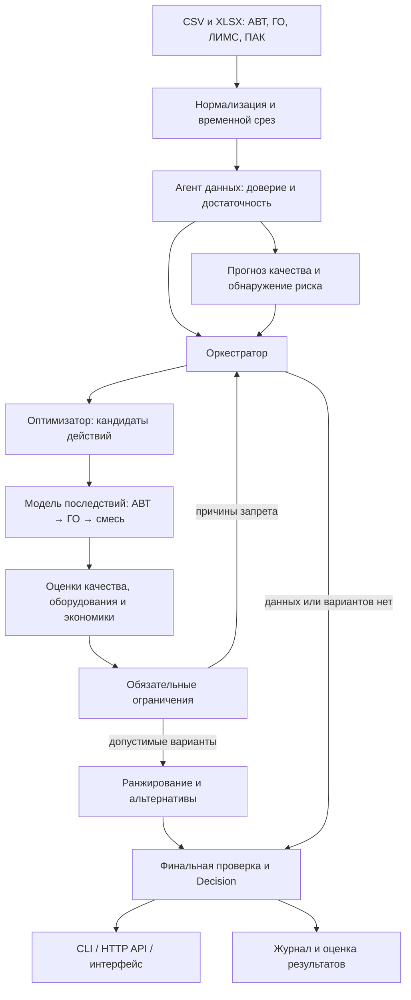

# Архитектура решения

Актуализация 2026-09-13 после переноса на Clean Architecture. Концепция — `solution.md`, состояние —
`state.md`, уточнения экспертов — `organizer-clarifications.md`. Ниже архитектура с актуальными
статусами компонентов; блоки целевых контрактов описывают смысл, точные Python-поля — в коде.

## 1. Система и границы

Продукт — advisory-система для оператора цепочки АВТ → гидроочистка → смешение.
Вход: телеметрия, лабораторные анализы, онлайн-анализаторы, подтвержденные ограничения и сценарий.
Выход: предложение изменения ограниченного набора управляющих параметров, сохранение режима
либо мотивированный отказ; прогноз последствий, альтернативы и журнал расчета.

Развертывание: модульный монолит на Python. Агенты — отдельные программные роли с типизированными
входами/выходами внутри одного приложения. Распределенные сервисы и брокер сообщений сейчас не нужны.
Пользовательский интерфейс и HTTP API — адаптеры к тому же расчетному ядру, которое вызывается из CLI.
Рекомендации адресованы оператору; подключение к автоматическому управлению оборудованием не входит
в текущий объем работ.

Текущий стек ядра: Python 3.12, pandas, NumPy, scikit-learn, CatBoost, openpyxl, pytest, uv.
HTTP API реализован стандартным `http.server`, экран — HTML/JavaScript. Фреймворков нет;
CLI, сервер и воспроизведение используют одно расчётное ядро.

## 2. Два контура

**Offline:** загрузка исходников → проверка/нормализация → построение признаков → временные
train/validation/calibration/test → обучение/выбор моделей → калибровка → отчет и версия артефактов.

**Runtime:** момент принятия решения → доступные на этот момент данные → состояние → прогноз
качества и риска → генерация действий → оценка последствий → жесткие ограничения → ранжирование
→ итоговое решение и журнал.

Runtime включает обычный вызов по времени и воспроизведение истории. Исторический replay вызывает
то же ядро принятия решений. Будущий лабораторный факт передается только оценщику после решения.



Петля поиска ограничена бюджетом итераций и времени. Причины запрета позволяют изменить
следующий набор кандидатов, но никогда не ослабляют жесткие ограничения.

## 3. Компоненты и ответственность

| Компонент | Ответственность | Состояние сейчас |
|---|---|---|
| Source adapters | Независимое чтение временных рядов CSV/XLSX; единицы и идентификаторы источников | Реализовано для телеметрии и серы ЛИМС/ПАК |
| Tag registry | Семантика тегов, единицы, измеряемость/управляемость, статус подтверждения | Есть config/parameters.json и requirements-map.md; масштабы части управляющих тегов не подтверждены |
| State builder | Временной срез по доступности, лаги/окна, возраст данных | `infrastructure/data/data.py`; задержка ЛИМС пока параметр эксперимента |
| Data agent | Доверие к источникам, достаточность данных, выбор резервного режима | `application/services/trust.py`; непригодное состояние блокирует запуск прогноза |
| Forecast models | Прогноз будущего качества с диапазоном | Сера и T95 проверены по времени; простые прогнозы не побеждены, цетан unknown |
| Risk detector | Обнаружение превышения, отдельная настройка чувствительности/ложных тревог | Реализован; устойчивого превосходства ML над простым порогом нет |
| Action-effect model | Оценка изменения цепочки после конкретного действия | Сценарная ChainModel АВТ/ГО с лагами; промышленная точность не доказана |
| Quality agent | Проверка качества каждого кандидата с учетом неопределенности | S/T95/цетан в каждой точке траектории, missing/unknown блокирует |
| Reliability agent | Ограничения оборудования, объяснимые показатели нагрузки; ограничения переключений только как явная политика сценария | Сценарные диапазоны, пределы отбора, запасы и индекс тяжести режима; не оценка ресурса |
| Optimizer agent | Генерация кандидатов, пересчет после запрета, допустимые альтернативы | Уставки АВТ/ГО, смесь, выпуск, присадка, постоянные и переходные планы; ограниченный бюджет |
| Hard-constraint gate | Единая обязательная проверка кандидата и окончательного решения | `domain/advisory/gate.py`; проверка полной сетки, обязательных полей и конечного остатка |
| Coordinator | Порядок вызовов, выбор ветки/fallback, ограниченная петля поиска, отказ | `application/use_cases/MakeDecision` и `PlanOperation`; veto агентов до ранжирования, feedback с новым содержимым, финальная перепроверка |
| Economics evaluator | Выпуск, условные затраты, энергопотребление, цена изменения режима | Сценарные proxies; не реальные тарифы или подтвержденная экономия |
| Replay/evaluation | Воспроизведение, метрики, сценарии отказов, сравнение вариантов системы | `application/use_cases/ReplayDecisions` и `evaluation/`; раздельные history/simulated, pause/resume, четыре сценария |
| HTTP API / UI | Временная шкала, состояние цепочки, кандидаты, объяснение решения | `presentation/web/`; одношаговый рецепт и все изменения видны |

## 4. Контракты данных

Целевые контракты описывают смысл полей; это не утверждение, что все соответствующие классы уже созданы.
На первом этапе достаточны dataclasses и явная валидация. Бизнес-логика не работает с произвольными
словарями из интерфейса напрямую.

```text
Observation
  tag_id, source, value, unit
  measured_at, available_at
  validity, issues[], provenance

PlantState
  as_of, observations, features
  data_quality, missing_inputs[], operating_region

ForecastBundle
  target, horizon, value, lower, upper
  model_version, calibration_version, valid_from
  applicability, limitations[]

RiskAssessment
  target, score, threshold, alarm | unavailable
  detector_version, threshold_version

ActionCandidate
  id, controls{tag_id: target_value}
  blending_mass_fractions{}, throughput, execution_horizon
  scope: confirmed_model | synthetic_scenario

OutcomeEstimate
  candidate_id, qualities{}, production, energy_proxy, severity_proxy
  prediction_intervals, applicability, assumptions[], model_version

GateResult
  candidate_id, feasible
  checks[{constraint_id, observed_or_predicted, limit, pass | fail | unknown}]
  rejection_reasons[]

Decision
  id, as_of, forecast_for, status
  state_snapshot_id, forecasts, risk, selected_action | null
  expected_outcome, alternatives[], rejected_candidates[]
  agent_trace[], scenario_version, model_versions, scope
```

`unknown` по обязательному ограничению блокирует рекомендацию в заявленном промышленном объеме.
Сценарный результат может быть показан отдельно с перечислением непроверенных требований,
но не превращается в разрешение промышленного выпуска.

Статусы текущего прототипа: `hold`, `recommend_scenario`, `refuse`.
`commercial_release_allowed=false` во всех текущих результатах. Для целевого `recommend` нужны
подтвержденный объем применимости, управляющая карта и достаточный набор ограничений.

## 5. Предсказание и оценка действий — разные модели

```text
ForecastModel.predict(state_t, horizon) -> качество в будущем
TransitionModel.evaluate(state_t, action, horizon) -> последствия конкретного действия
```

Первая модель учится на исторических соответствиях. Во второй действие является частью постановки:
нужно обосновать физические зависимости, допустимую область и задержку отклика. Замена одного
признака в обычном CatBoost не доказывает эффект управления.

Целевой TransitionModel — ограниченная составная модель:

- **АВТ:** влияние подтвержденных управляющих изменений на характеристики и выход выбранных фракций.
- **Гидроочистка:** влияние состава/расхода сырья и подтвержденных управляющих изменений на качество,
  с задержкой и оценкой тяжести режима.
- **Смешение:** свойства и доступность компонентов; для серы — материальный баланс по массовым долям.
  Для плотности и температурных свойств нужны отдельные корректные зависимости.

Выход каждой стадии становится входом следующей. Ошибки/диапазоны также передаются дальше;
неподтвержденный участок не должен выдавать точный итоговый эффект всей цепочки.
Сейчас реализован только последний пункт в явном синтетическом сценарии.

## 6. Цикл оркестрации

1. Получить `PlantState` на момент t. Не использовать наблюдения с available_at > t.
2. Проверить доступность самих моделей и калибровок на t, источник и применимость прогноза.
3. Получить качество/риск и текущие ограничения. При недостоверных критических входах — отказ.
4. Оценить `no-op`: сохранение режима обязательно входит в постановку.
5. Сгенерировать ограниченный набор небольших действий по разрешенным управляющим параметрам.
6. Рассчитать последствия каждого действия. Отсутствие применимой модели дает запрет кандидата.
7. Агент качества и агент оборудования возвращают оценки и конкретные причины запрета.
8. Gate отбрасывает все нарушения. Если допустимых кандидатов нет, оркестратор запрашивает
   ограниченный пересчет: например, меньший выпуск вместо недоступного увеличения нагрузки.
9. Среди допустимых вариантов сравнить выпуск, затраты/энергию, нагрузку и размер изменения.
   Сохранить альтернативы с различными компромиссами; зафиксировать правило выбора в конфиге.
10. Повторно проверить выбранное действие тем же Gate. Записать Decision и все версии/допущения.

Целевое ранжирование: hard constraints → Парето-набор → явная политика выбора.
Текущее ранжирование: после проверок максимум выпуска, затем меньшая условная стоимость и нагрузка.
При безопасном текущем режиме прототип сохраняет режим. Целевая политика должна учитывать
минимальный полезный эффект изменения и ограничения частоты переключений.

Агенты используют структурированные сообщения; численные запреты выполняет код.
LLM для принятия обязательных решений не нужен. Если позже добавляется текстовый помощник,
он получает готовый Decision и не может изменять действия, ограничения или результаты проверок.

## 7. Фактическая структура репозитория

```text
src/neftecode/
  domain/
    shared/                   # единицы, происхождение значений, общие действия
    monitoring/               # наблюдения, прогноз и состояние установки
    production/               # сценарий, процесс, смешение, запасы, экономика
    advisory/                 # планы, gate, оптимизация и решение
  application/
    ports/                    # контракты внешних источников и адаптеров
    services/                 # доверие к данным и объяснение
    use_cases/                # MakeDecision, PlanOperation, GetLiveAdvice, ReplayDecisions
  infrastructure/
    data/                     # CSV/XLSX и подготовка данных
    ml/                       # обучение, прогноз, риск и runtime-сборка данных
    config/                   # чтение и проверка JSON-сценариев
    artifacts/                # сохранение результатов
    live/                     # адаптер реальных измерений к GetLiveAdvice
  evaluation/                 # benchmark, ВАК, эпизоды, лаги и устойчивость
  presentation/
    cli.py                    # аргументы и команды
    demo.py                   # демонстрационные сцены
    web/                      # HTTP и HTML
  bootstrap.py               # composition root: сборка слоёв и запуск CLI
config/                       # эксперименты, ограничения, сценарии, управляющая карта
tests/                        # временные контракты, запреты, взаимодействие, интеграция
artifacts/                    # модели, отчеты, результаты; вне git
context/                      # решения, состояние, архитектура, исходные исследования
task/                         # выданные исходники; не изменяем
```

Зависимости направлены внутрь:

```text
presentation ─┐
infrastructure ├→ application → domain
evaluation ───┘
```

`bootstrap.py` — внешний composition root. Только он знает о конкретных адаптерах разных
внешних слоёв и связывает их с прикладными сценариями. AST-тест запрещает обратные зависимости,
обращения внутренних слоёв к pandas/HTTP/openpyxl и старые плоские импорты.

Хранение сейчас файловое: CSV/XLSX на входе, локальные модели, CSV/JSON/JSONL на выходе.
Для следующего этапа можно добавить кэш нормализованных рядов и индекс решений. СУБД и очереди
появляются только при конкретной необходимости, не являются условием работы прототипа.

## 8. Проверка и воспроизводимость

- Временные разбиения, раздельный выбор модели/калибровка/оценка; модель недоступна до valid_from.
- Ни один редкий лабораторный анализ не размножается в тысячи независимых целевых строк.
- Метрики прогноза: MAE, ошибка около предела, покрытие/ширина диапазона.
- Метрики риска: TP/FP/FN/TN, доступность оценки, recall и доля ложных тревог на одинаковых пробах.
- Метрики советчика: покрытие рекомендациями/сохранениями/отказами, причины запретов,
  число пересчетов и соблюдение ограничений в заявленном сценарии.
- Проверки всех кандидатов и повторная проверка выбранного; низкий risk score не отменяет Gate.
- Сценарии нормального режима, риска, отказа ПАК, старых анализов, конфликта агентов и отсутствия
  допустимого действия. Инъекции сбоев помечаются отдельно от реальных данных.
- Хеши источников/кода/зависимостей, конфиги и версии моделей входят в артефакт эксперимента.
- Реальный эффект управления и экономию проверять отдельно: исторический replay не показывает,
  что произошло бы после неисполненных действий.

Текущий benchmark: 2023–2024 обучение, 2025 H1 выбор, 2025 H2 калибровка, 2026 сравнение.
2026 уже просмотрен. Следующие изменения не следует называть проверенными на новом слепом тесте.

## 9. Состояние архитектуры после переноса

Доменные контексты, прикладные сценарии, порты, адаптеры данных и ML, оценка и UI/API разделены.
Старые плоские модули удалены; CLI-команды и JSON решений сохранены. Тестирование: 755 passed.
Обязательная неизвестность блокирует план; текущий рецепт, доза и
выпуск задают hold. Явно датированное действие сохраняет время отклика, сохранённая операция
без такого журнала считается установившейся. Приток и отбор считаются на сетке; расход притока
задан сценарием и не равен автоматически всему выходу гидроочистки.

Остались научные/предметные ограничения: неподтверждённые заводом коэффициенты отклика,
масштабы тегов, лабораторная задержка без точных дат выдачи, отсутствие фактического блендинга
и измеренной пользы управления. Эти ограничения нельзя закрывать усложнением инфраструктуры.

## 10. Расширение концепции от 12 сентября: план во времени

Этот цикл реализован в `domain/production/inventory.py` и прикладных сценариях `PlanOperation`,
`MakeDecision`, `ReplayDecisions`. Ниже сохранены смысловые требования контрактов; не все
расширенные поля (например property_uncertainty) представлены буквально. Python-монолит и единое
ядро CLI/UI сохраняются.

Вместо оценки только конечного состояния кандидат содержит несколько согласованных шагов на горизонте до 3 часов. Пересчёт через 15–60 минут учитывает фактически исполненные действия и их ожидаемый отклик. Оператор подтверждает выполнение; выданный совет сам по себе не меняет состояние оборудования или запасов.

Целевые расширения контрактов:

```text
TankState
  tank_id, available, inventory_mass, properties{}, property_uncertainty
  inflow/outflow_limits, observation_times, assumptions[]

PendingAction
  action_id, proposed_at, confirmed_at | null, execution_status
  expected_response_window, observed_response_status

PlantState (дополнение)
  tanks[], pending_actions[], current_recipe, current_throughput

ActionPlan
  id, steps[{time, controls, recipe, throughput, additive_dose}]
  execution_conditions[], assumptions[], scope

TrajectoryEstimate
  plan_id, timeline[{time, qualities, inventories, production,
    cost_proxy, severity_proxy, uncertainty, applicability}]
  terminal_inventory, model_versions, sensitivity_results[]

PlanGateResult
  plan_id, checks_by_time[], first_violation | null
  unknown_requirements[], feasible

Decision (дополнение)
  selected_plan | null, immediate_action | null
  alternative_plans[], next_review_at, reconsideration_conditions[]
```

Модель последствий получает исходное состояние, план, горизонт, подтверждённые ожидающие действия и сценарий. Возвращает траекторию всей цепочки и баланс ресурсов; не подставляет будущее лабораторное значение из истории в решение.

Gate проверяет серу, T95, цетановое число, массовые доли, доступные остатки и прочие явно заданные пределы **на каждом шаге**. Неизвестное критическое условие блокирует план. Финальное действие проверяется повторно; низкий риск-скор не отменяет проверку. Оценка запасов на конце горизонта нужна, чтобы не спрятать будущую нехватку за последней точкой расчёта; конкретная политика ещё не выбрана.

Ранжирование сравнивает допустимые планы по выпуску, условным затратам, расходу резерва/присадки, тяжести режима и лишним изменениям. Сохранение режима остаётся кандидатом. Небольшой перебор планов достаточен для начала; глобальную оптимальность не обещаем. Правило выбора и допущения фиксируются до сравнительного эксперимента.

Надёжность должна получить содержательный показатель тяжести режима ГО при наличии корректных переменных. Сценарный предел насоса можно сохранить как ограничение конкретного сценария; его нельзя выдавать за оценку реального ресурса оборудования. По уточнению экспертов скорость изменений в кейсе не ограничена; прежние лимиты дельты и частоты — наша политика, если её оставляем, а не промышленный норматив.

UI показывает состояние цепочки, ближайшее действие, план/задержку, запасы, альтернативы и реальные сообщения агентов. Изменение сырья, резервуара, требований или источников данных вызывает тот же runtime. Возможный текстовый помощник лишь объясняет готовое решение и не меняет числа.

В оценке разделены история прогноза и модельная проверка действий. Сравнение с hold/порогом дополняется отключением лагов/запасов и изменением параметров проверяющей модели. Числа пользы не называются экономией реального завода.

Перед реализацией сверить параметры с `organizer-clarifications.md`: горизонт/отклик 0–3 часа, ЛИМС до 4 часов после отбора, управляющие ГО P8/T11/F19 с неразрешёнными вопросами масштаба, исправления ВАК, три свойства смеси и условия присадки.
